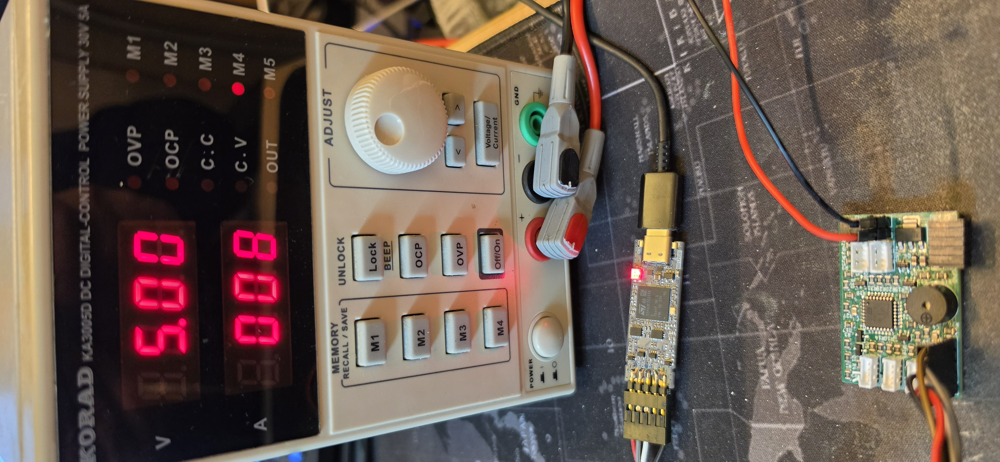

# BKHD Fan Controller

> # ⚠️ WORK IN PROGRESS — DO NOT REPLICATE YET ⚠️
>
> **This project is under active development and is NOT ready for replication.**
>
> Hardware, firmware, protocol, and host software are all still evolving. Pin
> assignments, schematics, and APIs may change without notice. Nothing here
> has been fully validated on the final PCB. Building this now may result in
> damaged hardware, non-working fans, or worse.
>
> **Please wait for a tagged release (`v1.0.0` or later) before attempting to
> build or flash anything from this repository.**

STM32G031-based 5-channel PWM fan controller with Linux host software for the BKHD-2049NP-6L mini PC.

## Features

- **5 independent PWM channels** — 25 kHz, 0-100% duty, for 4-pin PC fans
- **TACH monitoring** — RPM measurement per fan with stall detection
- **NTC input** — one analog NTC thermistor input (Semitec 104NT) on PB7,
  surfaced to the host via the STS frame as a virtual `ntc1` sensor
- **Buzzer alarm** — active buzzer alerts on fan failure or host communication loss
- **Host watchdog** — all fans ramp to 100% if host goes silent for 60 seconds
- **UART protocol** — simple ASCII (NMEA-style) for easy debugging with any terminal
- **Linux host daemon** — reads hwmon temperatures, computes fan curves, sends set-points
- **systemd integration** — runs as a service with syslog-compatible logging

## Hardware

- **MCU:** STM32G031K8T6 (Cortex-M0+, 64 MHz, 64 KB Flash, 8 KB RAM)
- **Fans:** 5x 5V 4-pin PWM via NPN open-collector drivers
- **TACH:** 5x input with 3.3V pull-up, EXTI-based pulse counting
- **NTC:** Semitec 104NT-4-R025H42G (100 kΩ, B = 4267 K) in a 100 kΩ divider
  to +3V3, sampled on ADC1_IN11 (PB7). Mount with thermal adhesive on the
  component you want to monitor (e.g. the Intel 82599ES heatsink).
- **Buzzer:** Active 5V buzzer via NPN
- **UART:** USART2 @ 115200 8N1 with level shifting

See [docs/hardware-notes.md](docs/hardware-notes.md) for schematics and pin mapping.

## Building the Firmware

### Prerequisites

<details>
<summary><strong>Linux (Ubuntu/Debian)</strong></summary>

```bash
sudo apt install gcc-arm-none-eabi cmake make
```

</details>

<details>
<summary><strong>Linux (Arch)</strong></summary>

```bash
sudo pacman -S arm-none-eabi-gcc arm-none-eabi-newlib cmake
```

</details>

<details>
<summary><strong>macOS</strong></summary>

Install [Homebrew](https://brew.sh) if not already present, then:

```bash
brew install --cask gcc-arm-embedded
brew install cmake
```

</details>

<details>
<summary><strong>Windows</strong></summary>

1. Download the [Arm GNU Toolchain](https://developer.arm.com/downloads/-/arm-gnu-toolchain-downloads) — choose the `arm-none-eabi` AArch32 bare-metal target for Windows:
   - **`.msi` installer** (recommended) — installs to `C:\Program Files (x86)\Arm\GNU Toolchain mingw-w64-i686-arm-none-eabi\bin`. After installation, add this `bin` directory to your system PATH manually.
   - **`.zip` portable** — extract anywhere and add the `bin` directory to your PATH.
2. Install [CMake](https://cmake.org/download/) (`.msi` installer, check **"Add CMake to PATH"**).
3. Install a build system — either:
   - [Ninja](https://ninja-build.org/) (recommended, drop `ninja.exe` into a directory on your PATH), or
   - `mingw32-make` via [MSYS2](https://www.msys2.org/) (`pacman -S mingw-w64-x86_64-make`) or [chocolatey](https://chocolatey.org/) (`choco install make`) — ensure `mingw32-make.exe` is on your PATH.

Verify after installation:

```cmd
arm-none-eabi-gcc --version
cmake --version
```

</details>

### Clone and init submodules

```bash
git clone https://github.com/MrDix/BKHD-FanController.git
cd BKHD-FanController
git submodule update --init --recursive
```

### Build

Linux / macOS:

```bash
cd firmware
cmake -B build -DCMAKE_TOOLCHAIN_FILE=arm-none-eabi.cmake
cmake --build build
```

Windows (a generator must be specified — CMake defaults to NMake which requires Visual Studio):

```cmd
cd firmware
rem With Ninja (recommended):
cmake -B build -G Ninja -DCMAKE_TOOLCHAIN_FILE=arm-none-eabi.cmake
rem Or with MinGW Make (if installed via MSYS2/chocolatey):
cmake -B build -G "MinGW Makefiles" -DCMAKE_TOOLCHAIN_FILE=arm-none-eabi.cmake

cmake --build build
```

Output: `build/fan_controller.bin` and `build/fan_controller.hex`

### Flash via SWD

#### Using an STLINK-V3MINIE

The [STLINK-V3MINIE](https://www.st.com/en/development-tools/stlink-v3minie.html) connects to the MCU via the SWD header (SWDIO, SWCLK, GND, 3.3V).

> **Important:** The STLINK-V3MINIE does **not** supply power to the target board — it only measures the target voltage. Your board must be powered externally (e.g. via USB or a 5V supply) before flashing.



**Install flash tools:**

<details>
<summary><strong>Linux</strong></summary>

```bash
# Option 1: stlink open-source tools (recommended)
sudo apt install stlink-tools        # Ubuntu/Debian
sudo pacman -S stlink                # Arch

# Option 2: OpenOCD
sudo apt install openocd             # Ubuntu/Debian
sudo pacman -S openocd               # Arch
```

udev rules (required for non-root access):

```bash
sudo cp /usr/lib/udev/rules.d/*stlink* /etc/udev/rules.d/ 2>/dev/null || \
  sudo sh -c 'echo "SUBSYSTEM==\"usb\", ATTR{idVendor}==\"0483\", ATTR{idProduct}==\"3754\", GROUP=\"plugdev\", MODE=\"0660\", TAG+=\"uaccess\"" > /etc/udev/rules.d/49-stlink.rules'
sudo udevadm control --reload-rules && sudo udevadm trigger

# If the device is still not accessible, add your user to the plugdev group:
# sudo usermod -a -G plugdev $USER
# (log out and back in for group changes to take effect)
```

</details>

<details>
<summary><strong>macOS</strong></summary>

```bash
# Option 1: stlink open-source tools (recommended)
brew install stlink

# Option 2: OpenOCD
brew install openocd
```

</details>

<details>
<summary><strong>Windows</strong></summary>

> **Note:** The open-source stlink-tools (`st-flash`) do **not** support the STLINK-V3 on Windows. Use OpenOCD or STM32CubeProgrammer instead.

**Option 1: OpenOCD (recommended)**

Download from [openocd.org/releases](https://github.com/openocd-org/openocd/releases) and extract the archive. Add the `bin` directory to your PATH (the `scripts` folder must remain in the same relative location).

**Option 2: STM32CubeProgrammer**

Download from [st.com](https://www.st.com/en/development-tools/stm32cubeprog.html). The installer is Java-based — the setup wizard may open behind other windows, check the taskbar if it appears to hang.

Default install path: `C:\Program Files\STMicroelectronics\STM32Cube\STM32CubeProgrammer\bin`

Add this directory to your PATH.

</details>

**Flash the firmware:**

Using [stlink tools](https://github.com/stlink-org/stlink) (Linux / macOS):
```bash
st-flash write build/fan_controller.bin 0x08000000
```

Using [OpenOCD](https://github.com/openocd-org/openocd/releases) (Linux / macOS / Windows):
```
openocd -f interface/stlink.cfg -f target/stm32g0x.cfg -c "program build/fan_controller.bin 0x08000000 verify reset exit"
```

Using [STM32CubeProgrammer](https://www.st.com/en/development-tools/stm32cubeprog.html) (Linux / macOS / Windows):
```bash
STM32_Programmer_CLI -c port=SWD -w build/fan_controller.bin 0x08000000 -v --start
```

**Verify the connection** (optional):
```bash
# stlink (Linux / macOS only)
st-info --probe

# OpenOCD (Linux / macOS / Windows)
openocd -f interface/stlink.cfg -f target/stm32g0x.cfg -c "init; shutdown"

# STM32CubeProgrammer (Linux / macOS / Windows)
STM32_Programmer_CLI -c port=SWD
```

## Host Software Setup

The host daemon is a small Python program (`pyserial` + `pyyaml`) that runs as
a systemd service. Modern distributions (Debian 12+, Ubuntu 23.10+, Fedora 38+,
and derivatives such as Proxmox VE 8+) enforce
[PEP 668](https://peps.python.org/pep-0668/) and will reject a plain
`pip3 install -r requirements.txt` with `externally-managed-environment`.
The instructions below use a dedicated virtual environment at
`/opt/bkhd-fanctrl/venv` so the daemon is fully isolated from the system
Python and the `fan-controller.service` unit can call the interpreter by
absolute path without any activation step.

### Install

```bash
# 1. Create the installation directory and virtual environment
sudo mkdir -p /opt/bkhd-fanctrl
sudo python3 -m venv /opt/bkhd-fanctrl/venv

# 2. Install dependencies inside the venv
sudo /opt/bkhd-fanctrl/venv/bin/pip install -r host/requirements.txt

# 3. Deploy the daemon and default config
sudo cp host/fan_controller.py /opt/bkhd-fanctrl/
sudo cp host/config.yaml /etc/fanctrl.yaml
```

> Older distributions without PEP 668 can still use the classic
> `sudo pip3 install -r host/requirements.txt` path, but the venv approach
> works everywhere and is strongly recommended.

### Configure

Edit `/etc/fanctrl.yaml` to match your sensor layout:

```bash
# Find your hwmon sensor names:
for h in /sys/class/hwmon/hwmon*; do echo "$h: $(cat $h/name)"; done
```

Sensor syntax in `config.yaml`:

| Value | Meaning |
|-------|---------|
| `"acpitz"`, `"coretemp"` | Match an hwmon device by its `name` file |
| `"nvme:0"`, `"nvme:1"` | Pick the Nth device when multiple share the same name (sorted by hwmon index) |
| `"ntc1"` | Virtual sensor populated from the MCU STS frame (Semitec 104NT on PB7) |

DDR5 temperature sensors (`spd5118`) require the kernel module to be loaded
and the per-DIMM I2C devices to be instantiated. On Proxmox VE / Debian:

```bash
echo spd5118 | sudo tee /etc/modules-load.d/spd5118.conf
sudo modprobe spd5118
# Bind DIMM addresses (SMBus bus number is typically i2c-1 for the I801 SMBus):
echo "spd5118 0x50" | sudo tee /sys/bus/i2c/devices/i2c-1/new_device
echo "spd5118 0x52" | sudo tee /sys/bus/i2c/devices/i2c-1/new_device
```

For persistent binding across reboots, add a udev rule (adjust the adapter
name match to your hardware):

```bash
sudo tee /etc/udev/rules.d/99-spd5118.rules <<'EOF'
ACTION=="add", SUBSYSTEM=="i2c-adapter", ATTR{name}=="SMBus I801 adapter*", \
  RUN+="/bin/sh -c 'echo spd5118 0x50 > /sys/bus/i2c/devices/%k/new_device; \
                    echo spd5118 0x52 > /sys/bus/i2c/devices/%k/new_device'"
EOF
sudo udevadm control --reload-rules
```

### Run manually

```bash
sudo /opt/bkhd-fanctrl/venv/bin/python /opt/bkhd-fanctrl/fan_controller.py \
    -c /etc/fanctrl.yaml -v
```

### Install as systemd service

```bash
sudo cp host/fan-controller.service /etc/systemd/system/
sudo systemctl daemon-reload
sudo systemctl enable --now fan-controller.service
sudo journalctl -u fan-controller -f  # view logs
```

### Updating

When the repo changes, redeploy the script and refresh dependencies:

```bash
git -C /usr/local/src/BKHD-FanController pull
sudo cp /usr/local/src/BKHD-FanController/host/fan_controller.py /opt/bkhd-fanctrl/
sudo /opt/bkhd-fanctrl/venv/bin/pip install -U -r \
    /usr/local/src/BKHD-FanController/host/requirements.txt
sudo systemctl restart fan-controller.service
```

## Protocol

See [docs/protocol.md](docs/protocol.md) for the full UART protocol specification.

Quick reference:

```
Host -> MCU:  $SET,80,60,50,40,30*4A     Set fan duties (%)
              $KA*35                      Keep-alive
              $ACK*24                     Acknowledge error

MCU -> Host:  $STS,1200,980,850,720,600,0,0,80,60,50,40,30,523*49
              RPM x5, error mask, watchdog, duty x5, NTC1 (tenths of °C)
```

### Debug with terminal

```bash
# Monitor MCU output:
screen /dev/ttyS0 115200

# Or with minicom:
minicom -D /dev/ttyS0 -b 115200
```

## Testing

### Loopback test (without hardware)

```bash
# Create virtual serial pair:
socat -d PTY,raw,echo=0 PTY,raw,echo=0
# Note the two /dev/pts/X paths, use one for the host script and one for minicom
```

### Test plan

1. Flash firmware, verify UART output with terminal (STS frames every 500ms, now with `t1` field)
2. Send `$SET,50,50,50,50,50*XX\n` manually, verify PWM with oscilloscope
3. Block a fan, verify buzzer activates and error bit appears in STS
4. Release the fan; verify the buzzer stops again (regression test for the stuck-on bug)
5. Stop sending commands for 60s, verify failsafe (all fans 100%)
6. Run host script, verify temperature-based fan curve operation
7. Kill host script, verify failsafe kicks in after 60s
8. Heat the NTC with a finger or hot-air station; verify `ntc1` rises in the host logs

## Project Structure

```
BKHD-FanController/
├── firmware/
│   ├── CMakeLists.txt          # Build configuration
│   ├── arm-none-eabi.cmake     # Cross-compilation toolchain
│   ├── STM32G031K8Tx.ld        # Linker script
│   ├── Inc/                    # Header files
│   └── Src/                    # Source files
│       ├── main.c              # Clock, GPIO, timer, UART, alarm edge
│       ├── fan_control.c       # PWM duty control
│       ├── tach_measure.c      # RPM measurement via EXTI
│       ├── uart_protocol.c     # NMEA-style protocol parser
│       ├── buzzer.c            # Buzzer control
│       ├── watchdog.c          # Host timeout + IWDG
│       └── ntc.c               # NTC sampling + Beta conversion
├── host/
│   ├── fan_controller.py       # Linux daemon
│   ├── config.yaml             # Fan curve configuration
│   ├── fan-controller.service  # systemd unit file
│   └── requirements.txt        # Python dependencies
└── docs/
    ├── protocol.md             # UART protocol spec
    └── hardware-notes.md       # Schematics and pin mapping
```

## License

MIT
