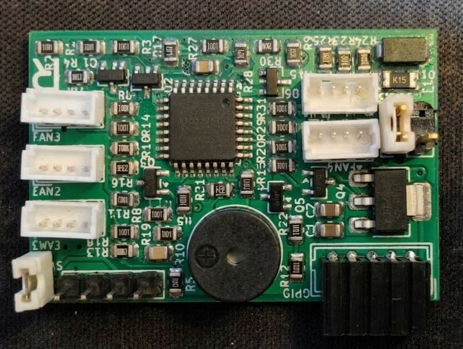

# Hardware Notes

## MCU: STM32G031K8T6 (LQFP32)

- Cortex-M0+, 64 MHz (via PLL from HSI16)
- 64 KB Flash, 8 KB RAM
- 3.3V supply via AMS1117-3.3 LDO from 5V rail

## Pin Assignment

| Pin | Function | Peripheral | AF | Direction |
|-----|----------|------------|----|-----------|
| PA1 | Buzzer | GPIO | - | Output |
| PA2 | UART TX | USART2 | AF1 | Output |
| PA3 | UART RX | USART2 | AF1 | Input |
| PA4 | PWM5 | TIM14_CH1 | AF4 | Output |
| PA5 | PWM4 | TIM2_CH1 | AF2 | Output |
| PA6 | PWM3 | TIM3_CH1 | AF1 | Output |
| PA7 | PWM2 | TIM3_CH2 | AF1 | Output |
| PA8 | PWM1 | TIM1_CH1 | AF2 | Output |
| PA13 | SWDIO | SWD | - | Bidir |
| PA14 | SWCLK | SWD | - | Input |
| PB0 | TACH1 | EXTI0 | - | Input |
| PB1 | TACH2 | EXTI1 | - | Input |
| PB2 | TACH3 | EXTI2 | - | Input |
| PB3 | TACH4 | EXTI3 | - | Input |
| PB4 | TACH5 | EXTI4 | - | Input |

## PWM Driver Circuit (per channel)

```
MCU_PWM ──[1k]──┬── NPN Base (MMBT3904)
                 │
               [100k]
                 │
                GND

Fan PWM ──[10k]──── 5V (pull-up)
    │
    └── NPN Collector
        NPN Emitter ── GND
```

- NPN inverts: MCU HIGH = Fan PWM LOW
- Firmware compensates: CCR = ARR * (100 - duty) / 100

## TACH Input Circuit (per channel)

```
Fan TACH ──[1k]──┬── MCU TACH pin
                 │
               [10k]
                 │
                3.3V
```

- TACH is open-drain from fan, pulled to 3.3V
- 2 pulses per revolution (Intel 4-pin standard)
- EXTI falling edge interrupt for pulse counting

## Buzzer Circuit

```
MCU PA1 ──[1k]──┬── NPN Base
                │
              [100k]
                │
               GND

5V ── Buzzer+ ── Buzzer- ── NPN Collector
                             NPN Emitter ── GND
```

- Active buzzer: MCU HIGH = buzzer sounds

## UART Level Shifting

```
STM32 TX (PA2) ──[100R]── Host RX  (series protection)

Host TX ──[10k]──┬── STM32 RX (PA3)
                 │
               [18k]
                 │
                GND
```

- Divider: 18k/(10k+18k) * 5V = 3.21V (safe for 3.3V MCU input)
- If host TX is 3.3V, divider gives 2.12V — still above VIH for CMOS

## Power

- Input: 5V (with TVS and Polyfuse)
- 3.3V rail: AMS1117-3.3 LDO
- Reset: 10k pull-up to 3.3V + 100nF to GND

## Jumper Configuration (Production Mode)



Two jumpers must be set when the board is installed in the BKHD-2049NP-6L enclosure:

- **Right jumper (power):** Bridges the GPIO connector power pins so the board is powered from the host mainboard's GPIO header.
- **Left jumper (SWD protection):** Placed on a single pin of the SWD header to prevent the exposed SWD pins from shorting against the adjacent NVMe heatsink inside the enclosure.
